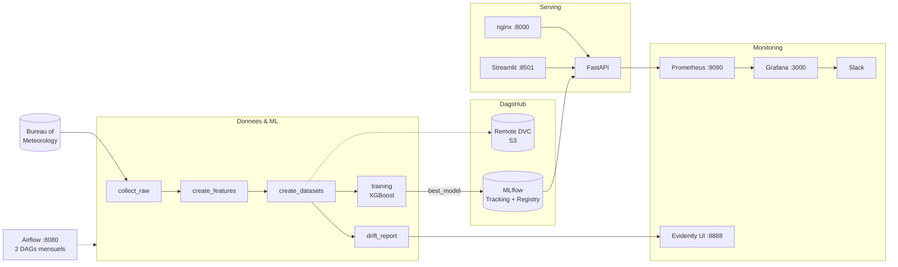

# 🌧️ MLOps Météo Australie

> Prédire s'il pleuvra demain sur chaque station météo australienne — et faire tourner
> le tout comme un vrai système de production : collecte automatisée, entraînement
> reproductible, déploiement, supervision et détection de dérive.

Ce dépôt n'est pas qu'un modèle de machine learning : c'est une **chaîne MLOps complète**,
conteneurisée de bout en bout, où chaque brique (données, entraînement, service,
orchestration, monitoring) est isolée et remplaçable.

---

## Ce que fait le projet

| | |
|---|---|
| **Question posée** | Pleuvra-t-il demain ? (classification binaire `RainTomorrow`) |
| **Données** | [Bureau of Meteorology](http://www.bom.gov.au/climate/dwo/) — 49 stations australiennes (46 exploitables) |
| **Historique** | ~120 000 observations quotidiennes, de 2007 à aujourd'hui |
| **Modèle** | XGBoost — PR-AUC ≈ 0.80 sur ~6 000 lignes de validation |
| **Cycle** | Collecte + réentraînement mensuels, entièrement automatisés |

---

## Architecture



Chaque bloc est un **conteneur Docker** orchestré par un unique `docker-compose.yml`.

---

## Fonctionnalités

### 📊 Pipeline de données versionné (DVC)

Trois étapes reproductibles déclarées dans [`src/pipelines/dvc.yaml`](src/pipelines/dvc.yaml) :

```
raw_processed  →  features  →  datasets
(collecte BOM)    (.parquet)   (train/test/valid)
```

`dvc repro` ne rejoue que ce qui a changé. Les données lourdes vivent sur le remote
DagsHub ; Git ne stocke que des pointeurs (`dvc.lock`).

**Features calculées** : saisonnalité (`dayofyear`), position (`latitude`/`longitude`),
direction du vent en encodage cyclique (`sin`/`cos`, pour éviter la rupture 360° ≈ 0°)
et surtout des **décalages temporels J-1 et J-3** sur 8 variables, qui capturent la
dynamique récente.

**Découpage chronologique par station** : 75 % train (le plus ancien), 20 % test,
5 % validation (le plus récent) — on entraîne sur le passé, on valide sur le récent.

### 🤖 Entraînement & registre de modèles

XGBoost avec `scale_pos_weight` (les jours de pluie sont minoritaires : ~22 %) et
early stopping. Chaque run logue paramètres, métriques et modèle dans **MLflow**.
Le challenger est comparé au champion sur la **PR-AUC** — bien plus fiable que
l'accuracy sur des classes déséquilibrées — et prend l'alias `best_model` s'il gagne.

### 🚀 API de prédiction

**FastAPI** derrière un reverse proxy **nginx** qui impose une clé API sur toutes les
routes sauf `/health`. L'API charge `best_model` depuis MLflow au démarrage.

### 🖥️ Interface utilisateur

**Streamlit** : carte interactive des 49 stations, sélection par clic ou liste,
prédiction en un bouton. Page de connexion (mots de passe hachés bcrypt) avec
**deux rôles** :

- **`user`** → l'interface de prédiction
- **`admin`** → en plus, les liens vers Grafana et l'UI Evidently, et la consultation
  des rapports de drift

### ⚙️ Orchestration (Airflow)

Deux DAGs plutôt qu'un seul — pour pouvoir **rejouer l'un sans l'autre** (recollecter
sans réentraîner, ou réentraîner après un ajustement du modèle) :

| DAG | Déclenchement | Étapes |
|---|---|---|
| `data_pipeline` | `@monthly` | `dvc_pull` → collecte → features → datasets → **drift** → `dvc push` → commit Git → déclenche ↓ |
| `model_training` | par le précédent | entraînement → mise à jour conditionnelle de la référence de drift · redémarrage de l'API |

Le pipeline **commit et pousse automatiquement** les pointeurs DVC sur Git.

### 📈 Monitoring

**Temps réel** — l'API expose `/metrics`, Prometheus collecte, Grafana affiche :
statut UP/DOWN, volume de prédictions, taux d'échec, confidence (moyenne et p95),
latence p95, répartition pluie / pas pluie. Deux alertes partent sur **Slack** :
API injoignable, et taux d'échec > 20 %.

Source de données, contact point et règles sont **provisionnés en fichiers**
([`monitoring/grafana/provisioning/`](monitoring/grafana/provisioning/)) : tout se
recrée automatiquement au démarrage.

**Dérive des données** — [Evidently](https://www.evidentlyai.com/) compare à chaque
collecte le nouveau jeu de données à une **référence** (le dataset ayant servi à
entraîner le modèle déployé). Il mesure le *data drift* par colonne, le *target drift*,
produit un rapport HTML et logue les métriques dans MLflow. Une UI dédiée permet de
suivre l'évolution dans le temps.

---

## Démarrage rapide

### Prérequis

Docker + Docker Compose, un compte [DagsHub](https://dagshub.com/), et un token GitHub
si vous voulez le versionnement automatique.

### 1. Configuration

```bash
cp .env.example .env
```

Variables à renseigner :

| Variable | Rôle |
|---|---|
| `DAGSHUB_USER_TOKEN` | accès MLflow + remote DVC |
| `AWS_ACCESS_KEY_ID` / `AWS_SECRET_ACCESS_KEY` | le **même token** DagsHub (stockage S3) |
| `GITHUB_TOKEN` | PAT *classic* (scope `repo`) pour le commit automatique |
| `HOST_PROJECT_PATH` | chemin **absolu** du dépôt sur votre machine (bind-mount Airflow) |
| `API_KEY` | clé exigée par nginx sur l'API |
| `AIRFLOW__WEBSERVER__SECRET_KEY` | identique entre webserver et scheduler |
| `GF_SECURITY_ADMIN_USER` / `_PASSWORD` | identifiants Grafana |
| `WEBHOOK_SLACK_URL` | webhook d'alerting (optionnel) |
| `DOCKER_GID` | GID du groupe `docker` — `stat -c '%g' /var/run/docker.sock` (défaut : 999) |

### 2. Construction

```bash
docker compose build
```

> Les services `drift` et `evidently-ui` réutilisent l'image du service `training` :
> lancez au moins `docker compose build training` avant de les démarrer.

### 3. Démarrage

```bash
docker compose up -d api nginx interface prometheus grafana evidently-ui
docker compose up airflow-init                                    # une seule fois
docker compose up -d postgres airflow-webserver airflow-scheduler
```

### 4. Récupérer les données et entraîner

```bash
docker compose run --rm drift bash -c 'cd src/pipelines && dvc pull'   # données existantes
docker compose run --rm training python -m src.training.training
```

---

## Les services

| Service | URL | Identifiants |
|---|---|---|
| 🖥️ Interface Streamlit | http://localhost:8501 | selon `src/interface/config.yaml` |
| 🚀 API (via nginx) | http://localhost:8000 | en-tête `x-api-key` |
| ⚙️ Airflow | http://localhost:8080 | `admin` / `admin` |
| 📊 Grafana | http://localhost:3000 | cf. `.env` |
| 🔥 Prometheus | http://localhost:9090 | — |
| 📈 Evidently UI | http://localhost:8888 | — |

---

## Utilisation

### Prédiction via l'API

```bash
curl -X POST http://localhost:8000/predict \
  -H "Content-Type: application/json" \
  -H "x-api-key: VOTRE_CLE" \
  -d '{"city":"Sydney"}'
```

```json
{"status":"success","city":"Sydney",
 "result":{"prediction":"Pas de pluie demain",
           "rain_probability":0.023,"confidence":0.953}}
```

`/health` reste accessible sans clé ; toute autre route sans clé valide renvoie `403`.

### En ligne de commande

```bash
docker compose run --rm predict                       # ville par défaut : Sydney
CITY=Canberra docker compose run --rm predict
```

### Rapport de drift à la demande

```bash
docker compose run --rm drift
```

### Générer du trafic (pour alimenter les dashboards)

```bash
python3 src/monitoring/load_generator.py --interval 2 --duration 600
```

---

## Structure du dépôt

```
├── dags/                    # DAGs Airflow (data_pipeline, model_training)
├── data/                    # Données versionnées par DVC (non committées)
│   ├── processed/  features/  datasets/  reference/
├── monitoring/
│   ├── prometheus/          # Configuration de scrape
│   └── grafana/             # Dashboard + provisioning (datasource, alertes)
├── reports/drift/           # Rapports Evidently (générés, non versionnés)
└── src/
    ├── data/                # Collecte, features, datasets
    ├── training/            # Entraînement XGBoost + comparaison de modèles
    ├── prediction/          # Chargement du modèle et inférence
    ├── api/                 # FastAPI + configuration nginx
    ├── interface/           # Application Streamlit
    ├── monitoring/          # Rapport de drift, générateur de charge
    └── pipelines/           # dvc.yaml + scripts du pipeline
```

---

## Garde-fous

Le pipeline embarque trois protections contre la **perte silencieuse de données
d'entraînement** — un incident réel qui avait réduit la base de 120 000 à 2 000 lignes
sans qu'aucune erreur ne soit levée :

1. **`dvc pull` en tête de DAG** — le pipeline part toujours de l'état versionné, même
   sur une machine où `data/` est vide.
2. **Refus du repli silencieux** — si `data/features` est vide, `create_features.py`
   s'arrête au lieu de reconstruire à partir des seuls mois fraîchement collectés
   (`--bootstrap` pour forcer une vraie initialisation).
3. **Canari sur la taille** — `create_datasets.py` refuse d'écraser les datasets si le
   jeu d'entraînement perd plus de 20 % de ses lignes (`--allow_shrink` pour outrepasser).

---

## Dépannage

<details>
<summary><b>L'API renvoie 502 Bad Gateway</b></summary>

nginx ne joint plus le conteneur `api`. La configuration utilise le resolver DNS de
Docker pour re-résoudre l'adresse à chaque requête ; si le problème persiste :
`docker compose restart nginx`.
</details>

<details>
<summary><b>Les tâches Airflow échouent : « Permission denied » sur docker.sock</b></summary>

Le scheduler doit appartenir au groupe propriétaire du socket Docker. Renseignez
`DOCKER_GID` dans `.env` avec le résultat de `stat -c '%g' /var/run/docker.sock`.
</details>

<details>
<summary><b>Les logs Airflow affichent « 403 Forbidden »</b></summary>

Webserver et scheduler doivent partager la même `AIRFLOW__WEBSERVER__SECRET_KEY`.
Elle est chargée depuis `.env` dans les deux services.
</details>

<details>
<summary><b>Un lien (Grafana, Evidently) tourne dans le vide</b></summary>

Les boutons pointent vers `localhost`. En accès distant (port forwarding VS Code),
vérifiez que le port est bien transféré, ou surchargez `GRAFANA_URL` / `EVIDENTLY_URL`
dans `.env`.
</details>

---

## Stack technique

`Docker Compose` · `DVC` · `DagsHub` · `MLflow` · `XGBoost` · `Apache Airflow` ·
`PostgreSQL` · `FastAPI` · `nginx` · `Streamlit` · `Prometheus` · `Grafana` ·
`Evidently` · `Slack`
